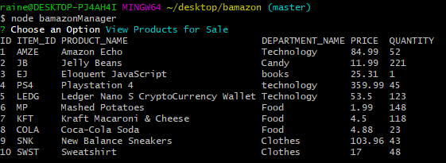
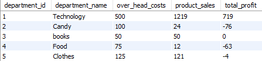

# Bamazon

## Technologies Used:

- JavaScript
- Node.js
- mySQL

## NPMs Used:

- DOTENV
- mySQL
- Inquirer
- Columnify

## Files:

- bamazonCustomer.js
- bamazonManager.js
- bamazonSupervisor.js

###bamazonCustomer
bamazonCustomer lists all the different products available to the customer, by Item_ID the customer than chooses which product they'd like to purchase.

You are than asked how many items of the unit you'd like to purchase. Upon deciding it will let you know whether or not there are enough units of the item, if there are you will get the total amount that it'll cost for said item. the mySQL database is also updated to reflect the new quantity total once the purchase is completed.

Below is a screenshot showing what happens when there are enough units available to purchase:

mySQL post-purchase. Notice that the Quantity for AMZE is 10 units less than in the first screenshot above that shows all teh products:

###bamazonManager
bamazonManager gives the user the ability to view the products for sale, view any low inventory, add inventory, and add new products.

####View Products for Sale
When selecting View Products for Sale the below appears showing all the items for sale:

####View Low Inventory
When selecting View Low Inventory you will get a list of all inventory with less than 5 units currently in inventory. In this example there was just one item with less than 5 units in inventory:

mySQL screenshot shows that there is only one item with less than 5 units.

####Add Inventory
When Add inventory is choosen you pick which item in the database you'd like to add inventory to.

mySQL pre-update:

mySQL post-update:

####Add new Products
When hitting add new products you will be prompted with 6 questions, once they are all answered the product will be added to the mySQL database.

mySQL showing added product:

###bamazonSupervisor
The bamazon Supervisor option allows the user to view product sales at a department level as well as create a new department. This is done by creating a new table called departments and linking it to the products table all within the bamazon database.

####View Product Sales by Department
When view product sales by department is choosen the departments table from mySQL is presented. The total profit shown in the far left is the product sales from all customer purchases minus the overhead costs.

####Create New Department
When selecting create new department you will be asked three more questions - department name, overhead cost, and product sales. The profit is than calculated automatically per what you enter.

mySQL departments database prior to addition:

mySQL departments database post addition:

